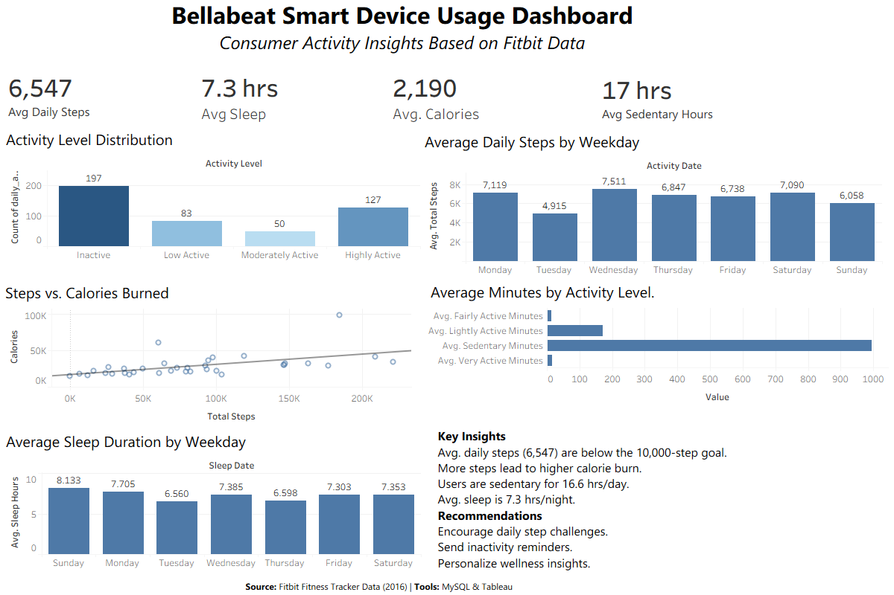

# Bellabeat Smart Device Usage Analysis

## Project Overview

This project is the capstone project for the Google Data Analytics Professional Certificate.

The objective is to analyze Fitbit smart device usage data using MySQL and visualize key insights in Tableau to provide data-driven marketing recommendations for Bellabeat.

---

## Business Task

Analyze smart device usage data to identify trends and provide marketing recommendations that can help Bellabeat grow its customer base.

---

## Analysis Process

1. Imported Fitbit CSV files into MySQL.
2. Cleaned and validated the data.
3. Performed exploratory SQL analysis.
4. Identified user activity and sleep patterns.
5. Built an interactive Tableau dashboard.
6. Generated business recommendations for Bellabeat.

## Tools Used

- MySQL
- Tableau
- GitHub

---

## Dataset

Fitbit Fitness Tracker Data (Kaggle)

---

## Dashboard Preview

---

## Project Summary

- Dataset: Fitbit Fitness Tracker Data (Kaggle)
- Records Analyzed: 940 daily activity records
- SQL Queries: 15+
- Dashboard: Tableau
- Database: MySQL

## Key Findings

- Users average fewer than 10,000 daily steps.
- Higher step counts lead to greater calorie burn.
- Users spend approximately 16.6 hours/day sedentary.
- Average sleep duration is approximately 7 hours/night.

---

## Marketing Recommendations

- Introduce personalized activity challenges.
- Encourage movement with inactivity reminders.
- Combine sleep and activity insights for personalized wellness recommendations.
